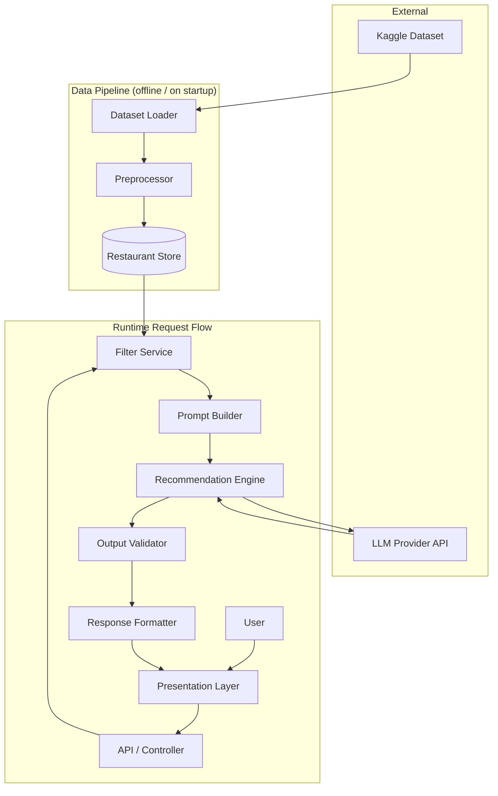
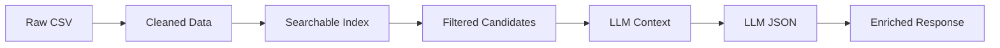
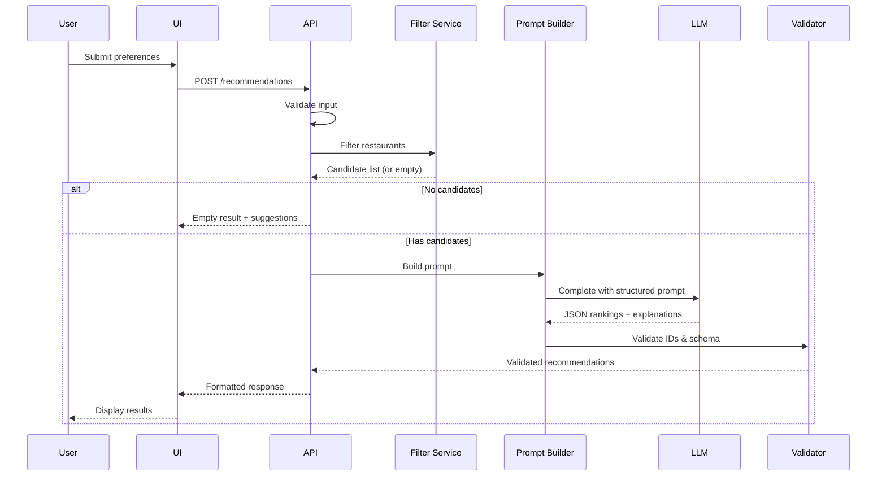
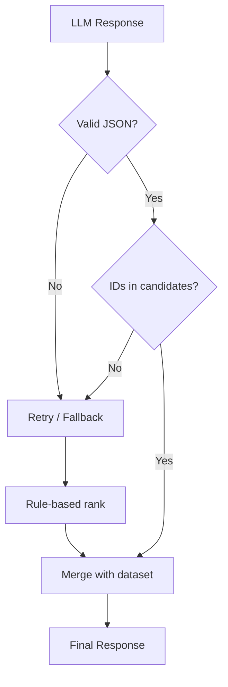
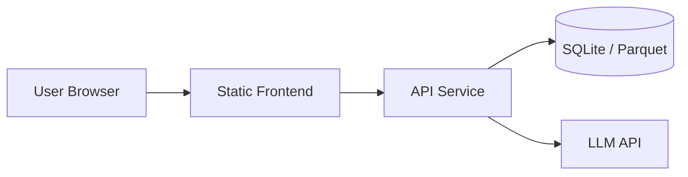

# Architecture: AI-Powered Food Delivery Recommendation System

This document describes the technical architecture for a Swiggy-inspired restaurant recommendation service. The system combines structured restaurant data from a real-world dataset with LLM reasoning to produce personalized, explainable recommendations grounded in factual data.

For product scope and success criteria, see [problemStatement.md](./problemStatement.md).

---

## Table of Contents

1. [Architecture Overview](#architecture-overview)
2. [Design Principles](#design-principles)
3. [High-Level System Diagram](#high-level-system-diagram)
4. [Component Architecture](#component-architecture)
5. [Data Architecture](#data-architecture)
6. [Request Lifecycle](#request-lifecycle)
7. [LLM Integration Design](#llm-integration-design)
8. [Hallucination Prevention](#hallucination-prevention)
9. [API Design](#api-design)
10. [Technology Stack](#technology-stack)
11. [Deployment Architecture](#deployment-architecture)
12. [Non-Functional Requirements](#non-functional-requirements)
13. [Future Extensions](#future-extensions)

---

## Architecture Overview

The system follows a **layered pipeline architecture** with a clear separation between data handling, business logic, AI reasoning, and presentation.

```
┌─────────────────────────────────────────────────────────────────────────┐
│                         PRESENTATION LAYER                                │
│              (Web UI / CLI — user preference collection & results)      │
└─────────────────────────────────┬───────────────────────────────────────┘
                                  │
┌─────────────────────────────────▼───────────────────────────────────────┐
│                         APPLICATION LAYER                               │
│         API Gateway / Controllers — request validation, orchestration   │
└─────────────────────────────────┬───────────────────────────────────────┘
                                  │
        ┌─────────────────────────┼─────────────────────────┐
        │                         │                         │
        ▼                         ▼                         ▼
┌───────────────┐       ┌─────────────────┐       ┌─────────────────┐
│  DATA LAYER   │       │ INTEGRATION     │       │ RECOMMENDATION  │
│  Ingestion &  │──────▶│ LAYER           │──────▶│ ENGINE (LLM)    │
│  Storage      │       │ Filter & Prompt │       │ Rank & Explain  │
└───────────────┘       └─────────────────┘       └─────────────────┘
```

**Core flow:** User preferences → structured filtering → LLM ranking and explanation → validated, user-friendly output.

---

## Design Principles

| Principle | Description |
|-----------|-------------|
| **Grounded recommendations** | Every recommended restaurant must exist in the dataset; LLM output is validated against filtered candidates. |
| **Separation of retrieval and reasoning** | Deterministic filters narrow the candidate set; the LLM ranks and explains within that set. |
| **Structured I/O** | User input and LLM responses use defined schemas (JSON) for reliability and testability. |
| **Fail-safe defaults** | If the LLM fails or returns invalid output, fall back to rule-based ranking (e.g., by rating). |
| **Modular layers** | Each workflow stage (ingestion, filter, LLM, display) is independently testable and replaceable. |

---

## High-Level System Diagram



---

## Component Architecture

### 1. Data Ingestion Layer

Responsible for loading, cleaning, and persisting restaurant data from the [Swiggy Restaurants Dataset](https://www.kaggle.com/datasets/ashishjangra27/swiggy-restaurants-dataset).

| Component | Responsibility |
|-----------|----------------|
| **Dataset Loader** | Downloads or reads CSV/JSON from local path; handles encoding and missing files. |
| **Preprocessor** | Normalizes city names, parses cuisines, converts cost and ratings to numeric types, drops invalid rows. |
| **Schema Mapper** | Maps raw columns to internal `Restaurant` model fields. |
| **Restaurant Store** | In-memory DataFrame, SQLite, or file-backed index for fast filtering. |

**Extracted fields (from problem statement):**

- Restaurant name
- Location / city
- Cuisine
- Cost for two
- Rating
- Rating count

**Suggested preprocessing rules:**

- Normalize city strings (trim, lowercase, alias mapping e.g. `Bengaluru` → `Bangalore`).
- Split multi-cuisine strings into arrays (e.g. `"North Indian, Chinese"`).
- Map budget tiers to cost ranges (configurable):
  - Low: ≤ ₹300
  - Medium: ₹300–₹600
  - High: > ₹600
- Filter or flag rows with missing name, city, or zero rating where inappropriate.

```
data/
├── raw/                    # Original Kaggle download
├── processed/              # Cleaned CSV/Parquet
└── config/
    └── budget_tiers.json   # Budget → cost range mapping
```

---

### 2. User Input Layer (Presentation)

Collects preferences and displays results.

| Component | Responsibility |
|-----------|----------------|
| **Preference Form** | Inputs for location, budget, cuisine, minimum rating, free-text extras. |
| **Validation UI** | Client-side hints; server-side validation for required fields and ranges. |
| **Results View** | Cards or table showing top N recommendations with all required fields. |
| **Error States** | Empty results, API errors, timeout messaging. |

**User preference model:**

```json
{
  "location": "Bangalore",
  "budget": "medium",
  "cuisine": "North Indian",
  "min_rating": 4.0,
  "additional_preferences": "family-friendly, quick delivery"
}
```

**Presentation options:**

- **Web app** (React/Vue + REST API) — best for demo and UX.
- **CLI** — fastest for development and testing.
- **Notebook** — exploratory analysis and prompt tuning.

---

### 3. Integration Layer

Bridges filtered data and the LLM. This layer is critical for grounding recommendations.

| Component | Responsibility |
|-----------|----------------|
| **Filter Service** | Applies deterministic filters from user preferences. |
| **Candidate Selector** | Returns top K candidates (e.g. 20–50) for LLM context window limits. |
| **Prompt Builder** | Assembles system + user prompts with user prefs and candidate JSON. |
| **Context Trimmer** | Ensures prompt fits model limits; prioritizes higher-rated / better-matched rows. |

**Filter logic (deterministic):**

```
candidates = all_restaurants
  .where(city == user.location)
  .where(rating >= user.min_rating)
  .where(cuisine matches user.cuisine)      // substring or token match
  .where(cost_for_two in budget_range)     // from budget tier config
```

**Additional preferences** are not filtered deterministically unless mappable to dataset fields; they are passed to the LLM for soft ranking and explanation.

**Output of integration layer:**

```json
{
  "user_preferences": { ... },
  "candidates": [
    {
      "id": "r_001",
      "name": "Restaurant A",
      "city": "Bangalore",
      "cuisine": "North Indian",
      "rating": 4.5,
      "rating_count": 1200,
      "cost_for_two": 450
    }
  ],
  "candidate_count": 15
}
```

---

### 4. Recommendation Engine (LLM)

Uses an LLM to rank candidates and generate explanations within the provided set.

| Component | Responsibility |
|-----------|----------------|
| **LLM Client** | Wraps OpenAI, Anthropic, Azure OpenAI, or local models (Ollama). |
| **Prompt Templates** | Versioned templates for system and user messages. |
| **Response Parser** | Parses structured JSON from LLM output. |
| **Retry Handler** | Retries on parse failure with stricter format instructions. |
| **Fallback Ranker** | Rule-based sort (rating × log(rating_count)) if LLM fails. |

**LLM tasks (from problem statement):**

1. Rank restaurants from the candidate list.
2. Provide per-restaurant explanations tied to user preferences.
3. Optionally produce a short summary of overall choices.

**Expected LLM response schema:**

```json
{
  "summary": "Based on your preference for North Indian food in Bangalore with a medium budget...",
  "recommendations": [
    {
      "restaurant_id": "r_001",
      "rank": 1,
      "why_recommended": "High rating (4.5) with North Indian cuisine and cost fits your medium budget."
    }
  ]
}
```

---

### 5. Output Display Layer

Merges validated LLM output with dataset records for the final user-facing response.

| Field | Source |
|-------|--------|
| Restaurant Name | Dataset |
| Cuisine | Dataset |
| Rating | Dataset |
| Cost for Two | Dataset |
| Location/City | Dataset |
| Why Recommended | LLM |

**Final API response example:**

```json
{
  "query": { "location": "Bangalore", "budget": "medium", ... },
  "summary": "...",
  "recommendations": [
    {
      "rank": 1,
      "restaurant_name": "Restaurant A",
      "cuisine": "North Indian",
      "rating": 4.5,
      "cost_for_two": 450,
      "location": "Bangalore",
      "why_recommended": "..."
    }
  ],
  "meta": {
    "total_candidates": 15,
    "returned": 5,
    "source": "llm"
  }
}
```

---

## Data Architecture

### Restaurant Entity

| Field | Type | Description |
|-------|------|-------------|
| `id` | string | Stable internal ID (generated during ingestion) |
| `name` | string | Restaurant name |
| `city` | string | Normalized city name |
| `cuisine` | string / list | Primary or list of cuisines |
| `cost_for_two` | number | Cost in INR |
| `rating` | float | Average rating |
| `rating_count` | integer | Number of ratings |

### Data Flow Stages



### Storage Options

| Option | Use Case |
|--------|----------|
| **Pandas DataFrame (in-memory)** | MVP, small dataset, fast iteration |
| **SQLite** | Persistent local store, simple queries |
| **Parquet + DuckDB** | Larger datasets, analytical filtering |

For the Swiggy Kaggle dataset scale, in-memory Pandas or SQLite is sufficient.

---

## Request Lifecycle



**Typical latency budget (target):**

- Filtering: &lt; 50 ms
- LLM call: 1–5 s (depends on provider and model)
- Validation + formatting: &lt; 50 ms

---

## LLM Integration Design

### Prompt Structure

**System message** — role, constraints, output format:

- Only recommend restaurants from the provided candidate list.
- Do not invent restaurant names or attributes.
- Return valid JSON matching the schema.
- Tie explanations to explicit user preferences.
- Rank by fit to preferences, not only by rating.

**User message** — structured context:

- Serialized user preferences.
- Candidate list as JSON array (id, name, city, cuisine, rating, cost_for_two).
- Requested number of top recommendations (e.g. top 5).

### Model Selection Guidelines

| Model Tier | Pros | Cons |
|------------|------|------|
| GPT-4o / Claude | Strong reasoning, reliable JSON | Cost, latency |
| GPT-4o-mini / Haiku | Fast, cheaper, good for MVP | Slightly weaker nuance |
| Local (Llama, Mistral) | No API cost, privacy | Setup complexity, quality variance |

**Recommendation for MVP:** Start with a cost-effective model with JSON mode; upgrade if explanation quality is insufficient.

### Temperature and Parameters

- **Temperature:** 0.2–0.4 (lower for consistent ranking; slightly higher if explanations feel repetitive).
- **Max tokens:** Sized for top 5–10 recommendations with explanations.
- **Response format:** `json_object` or tool/function calling where supported.

---

## Hallucination Prevention

Success criteria require recommendations grounded in dataset values. Architecture enforces this at multiple levels:

| Layer | Strategy |
|-------|----------|
| **Retrieval** | LLM only receives pre-filtered candidates; no open-ended search. |
| **Prompt** | Explicit instruction: "Only use restaurants from the candidates list." |
| **Structured output** | Require `restaurant_id` from candidate set, not free-text names. |
| **Validation** | Reject any ID not in candidate list; reject duplicate ranks. |
| **Enrichment** | Display fields (name, rating, cost) always read from dataset, never from LLM. |
| **Fallback** | On validation failure, use rule-based ranking from filtered candidates. |



---

## API Design

### Endpoints

| Method | Path | Description |
|--------|------|-------------|
| `POST` | `/api/v1/recommendations` | Generate recommendations from preferences |
| `GET` | `/api/v1/cities` | List available cities (optional, for UI dropdown) |
| `GET` | `/api/v1/cuisines` | List available cuisines (optional) |
| `GET` | `/api/v1/health` | Health check |

### `POST /api/v1/recommendations`

**Request body:**

```json
{
  "location": "Bangalore",
  "budget": "low | medium | high",
  "cuisine": "North Indian",
  "min_rating": 4.0,
  "additional_preferences": "family-friendly",
  "limit": 5
}
```

**Response (200):**

```json
{
  "summary": "string",
  "recommendations": [ ... ],
  "meta": { "total_candidates": 12, "returned": 5, "source": "llm" }
}
```

**Response (400):** Invalid input (missing location, invalid budget).

**Response (200, empty):** No restaurants match filters — include `suggestions` (e.g. lower min_rating, broaden cuisine).

---

## Technology Stack

Recommended stack for a clean MVP aligned with the architecture:

| Layer | Technology | Rationale |
|-------|------------|-----------|
| **Language** | Python 3.11+ | Strong data + LLM ecosystem |
| **Data** | Pandas, SQLite | Simple ingestion and filtering |
| **API** | FastAPI | Fast, typed, auto OpenAPI docs |
| **LLM** | OpenAI / Anthropic SDK | Reliable structured output |
| **Frontend** | React or simple HTML + JS | User-friendly demo |
| **Config** | `.env` + pydantic-settings | API keys, budget tiers |
| **Testing** | pytest | Unit tests for filter, validator, parser |

### Suggested Project Structure

```
recommendation-engine/
├── Docs/
│   ├── problemStatement.md
│   └── architecture.md
├── data/
│   ├── raw/
│   └── processed/
├── src/
│   ├── data/
│   │   ├── loader.py
│   │   ├── preprocessor.py
│   │   └── store.py
│   ├── models/
│   │   ├── restaurant.py
│   │   └── preferences.py
│   ├── services/
│   │   ├── filter_service.py
│   │   ├── prompt_builder.py
│   │   ├── recommendation_engine.py
│   │   └── validator.py
│   ├── api/
│   │   ├── routes.py
│   │   └── schemas.py
│   └── main.py
├── prompts/
│   ├── system.txt
│   └── user_template.txt
├── tests/
├── frontend/               # optional
├── requirements.txt
├── .env.example
└── README.md
```

---

## Deployment Architecture

### Local Development

```
Developer Machine
├── Python app (FastAPI) — port 8000
├── Processed dataset on disk
├── LLM API key in .env
└── Optional: React dev server — port 3000
```

### Production (minimal)



| Component | Deployment Option |
|-----------|-------------------|
| API | Docker container on Railway, Fly.io, AWS ECS, or Azure App Service |
| Frontend | Static hosting (Vercel, Netlify, S3) or served by FastAPI |
| Data | Baked into container or loaded from object storage on startup |
| Secrets | Environment variables / secret manager |

**Cold start:** Load processed dataset into memory on application startup; expose readiness only after data is loaded.

---

## Non-Functional Requirements

| Category | Target |
|----------|--------|
| **Correctness** | 100% of displayed restaurants exist in dataset |
| **Availability** | Graceful degradation when LLM is unavailable |
| **Performance** | P95 &lt; 8 s end-to-end (LLM-dominated) |
| **Security** | API keys server-side only; validate all user input |
| **Observability** | Log filter counts, LLM latency, validation failures |
| **Testability** | Mock LLM client for unit/integration tests |

---

## Future Extensions

These are out of scope for the initial problem statement but fit the architecture:

- **Dish-level recommendations** when dish data becomes available.
- **Vector search** for semantic matching on `additional_preferences`.
- **Caching** of LLM responses for identical preference + candidate sets.
- **A/B testing** between LLM models and prompt versions.
- **User history** and personalized re-ranking.
- **Real-time data** ingestion from live APIs instead of static Kaggle snapshot.

---

## Summary

The architecture separates **deterministic retrieval** (filter by location, budget, cuisine, rating) from **LLM reasoning** (rank and explain within candidates). Dataset fields power all factual output; the LLM only selects and explains. Validation and fallback ranking ensure the system meets success criteria: grounded recommendations, preference-specific explanations, and a complete end-to-end flow from user input to displayed results.
