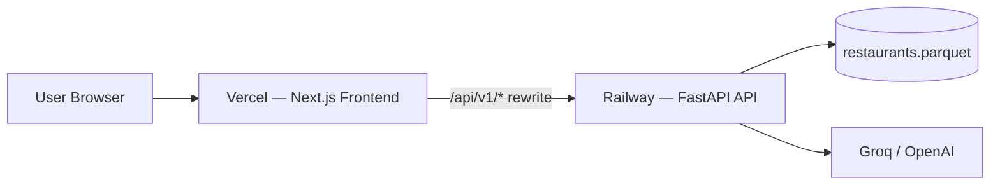
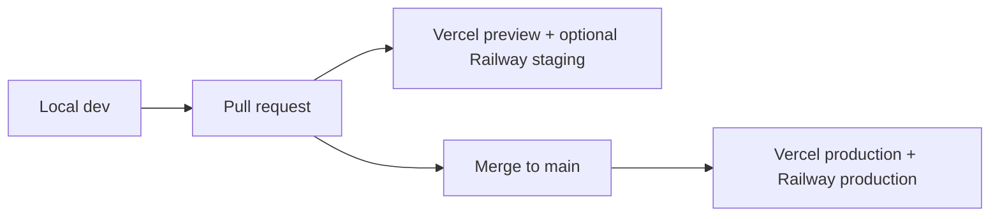

# Deployment Plan: BiteWise Recommendation Engine

This document describes how to deploy the **FastAPI backend on Railway** and the **Next.js frontend on Vercel**. It aligns with [architecture.md](./architecture.md) (Deployment Architecture) and Phase 7 of [implementation-plan.md](./implementation-plan.md).

---

## Table of Contents

1. [Overview](#overview)
2. [Deployment Order](#deployment-order)
3. [Prerequisites](#prerequisites)
4. [Pre-Deployment Checklist](#pre-deployment-checklist)
5. [Backend: Railway](#backend-railway)
6. [Frontend: Vercel](#frontend-vercel)
7. [Environment Variables Reference](#environment-variables-reference)
8. [Post-Deployment Verification](#post-deployment-verification)
9. [Continuous Deployment](#continuous-deployment)
10. [Troubleshooting](#troubleshooting)
11. [Rollback & Maintenance](#rollback--maintenance)
12. [Security Checklist](#security-checklist)
13. [Cost Estimate](#cost-estimate)

---

## Overview



| Component | Platform | Runtime | Notes |
|-----------|----------|---------|-------|
| **API** | Railway | Python 3.11+ / Uvicorn | Loads ~1.5 MB parquet into memory on startup |
| **Frontend** | Vercel | Next.js 14 | Proxies `/api/v1/*` to Railway via `next.config.mjs` rewrites |
| **Dataset** | Baked into Railway image | Parquet on disk | `data/processed/restaurants.parquet` (~1.5 MB) |
| **Secrets** | Platform env vars | — | `LLM_API_KEY` never exposed to browser |

**Recommended API integration pattern:** Use Vercel rewrites so the browser calls same-origin `/api/v1/...`. Vercel server-side rewrites forward those requests to Railway. This avoids browser CORS issues and keeps the LLM API key server-side only.

---

## Deployment Order

Deploy in this sequence:

1. **Prepare repo** — commit processed data, add Dockerfile, update CORS config
2. **Deploy backend on Railway** — obtain public API URL (e.g. `https://bitewise-api.up.railway.app`)
3. **Deploy frontend on Vercel** — set `API_PROXY_URL` to Railway URL
4. **Verify end-to-end** — health check, cities/cuisines, full recommendation flow
5. **Optional** — custom domains, monitoring, CI gates

---

## Prerequisites

### Accounts & access

- [Railway](https://railway.app) account (GitHub login recommended)
- [Vercel](https://vercel.com) account (GitHub login recommended)
- Git repository pushed to GitHub (Railway and Vercel deploy from Git)
- LLM provider API key ([Groq](https://console.groq.com) free tier or OpenAI)

### Local verification (run before deploying)

```bash
# Backend
pip install -r requirements.txt
uvicorn src.main:app --reload --port 8000
curl http://127.0.0.1:8000/api/v1/health

# Frontend (separate terminal)
cd frontend
npm install
npm run build
npm run start
```

Confirm:

- Health returns `"ready": true` and `restaurant_count > 0`
- `npm run build` succeeds with no TypeScript or ESLint errors
- Recommendation flow works locally with LLM key configured

### Repo requirements

| Item | Status | Action |
|------|--------|--------|
| `data/processed/restaurants.parquet` | Must be in Git | Not gitignored; commit before deploy |
| `data/config/budget_tiers.json` | Must be in Git | Already tracked |
| `.env` | Never commit | Use platform secret managers |
| `LLM_API_KEY` | Railway only | Never set on Vercel |

---

## Pre-Deployment Checklist

Complete these code changes before the first production deploy.

### 1. Add `Dockerfile` (repo root)

Railway deploys reliably from a Dockerfile. Create at project root:

```dockerfile
FROM python:3.11-slim

WORKDIR /app

# System deps for pyarrow
RUN apt-get update && apt-get install -y --no-install-recommends \
    build-essential \
    && rm -rf /var/lib/apt/lists/*

COPY requirements.txt .
RUN pip install --no-cache-dir -r requirements.txt

COPY src/ ./src/
COPY data/ ./data/

ENV DATA_PATH=data/processed/restaurants.parquet
ENV BUDGET_TIERS_PATH=data/config/budget_tiers.json

EXPOSE 8000

CMD uvicorn src.main:app --host 0.0.0.0 --port ${PORT:-8000}
```

> Railway injects `PORT` automatically. The `${PORT:-8000}` fallback supports local Docker runs.

### 2. Add `.dockerignore` (repo root)

```
.venv/
venv/
.env
.env.*
data/raw/
frontend/
frontend/node_modules/
.pytest_cache/
.git/
eval_runs/
__pycache__/
*.pyc
```

### 3. Update CORS for production

Current `src/main.py` only allows `localhost:3000`. Update to read allowed origins from an environment variable:

```python
# src/main.py — suggested change
import os

cors_origins = os.getenv(
    "CORS_ORIGINS",
    "http://localhost:3000,http://127.0.0.1:3000",
).split(",")

app.add_middleware(
    CORSMiddleware,
    allow_origins=[o.strip() for o in cors_origins if o.strip()],
    allow_credentials=True,
    allow_methods=["*"],
    allow_headers=["*"],
)
```

Set on Railway after Vercel deploy:

```
CORS_ORIGINS=https://your-app.vercel.app,https://www.your-domain.com
```

> If you use Vercel rewrites exclusively (recommended), browser requests never hit Railway directly, but CORS is still useful for direct API testing and future mobile clients.

### 4. Optional: `railway.toml`

```toml
[build]
builder = "dockerfile"
dockerfilePath = "Dockerfile"

[deploy]
healthcheckPath = "/api/v1/health"
healthcheckTimeout = 120
restartPolicyType = "ON_FAILURE"
restartPolicyMaxRetries = 3
```

### 5. Commit processed dataset

Ensure `data/processed/restaurants.parquet` is tracked in Git:

```bash
git add data/processed/restaurants.parquet
git status   # confirm it is staged / tracked
```

---

## Backend: Railway

### Step 1 — Create Railway project

1. Go to [railway.app/new](https://railway.app/new)
2. Choose **Deploy from GitHub repo**
3. Select the `recommendation-engine` repository
4. Railway creates a service from the repo

### Step 2 — Configure service settings

| Setting | Value |
|---------|-------|
| **Root directory** | `/` (repo root) |
| **Builder** | Dockerfile (auto-detected if `Dockerfile` exists) |
| **Start command** | *(leave empty — uses Dockerfile `CMD`)* |
| **Health check path** | `/api/v1/health` |
| **Port** | Railway auto-detects from `EXPOSE` / `PORT` |

### Step 3 — Set environment variables

In Railway → Service → **Variables**:

| Variable | Value | Required |
|----------|-------|----------|
| `LLM_API_KEY` | Your Groq or OpenAI key | Yes (for AI explanations; fallback works without) |
| `LLM_BASE_URL` | `https://api.groq.com/openai/v1` | Yes (Groq) |
| `LLM_MODEL` | `llama-3.1-8b-instant` | Yes |
| `LLM_TEMPERATURE` | `0.3` | Optional |
| `DATA_PATH` | `data/processed/restaurants.parquet` | Optional (default) |
| `BUDGET_TIERS_PATH` | `data/config/budget_tiers.json` | Optional (default) |
| `CORS_ORIGINS` | Vercel URL(s), comma-separated | After frontend deploy |

Do **not** expose `LLM_API_KEY` in build logs. Railway marks variables as secrets by default.

### Step 4 — Deploy and get public URL

1. Click **Deploy** (or push to the connected branch to trigger auto-deploy)
2. Wait for build + health check to pass
3. Go to **Settings → Networking → Generate Domain**
4. Note the public URL, e.g. `https://recommendation-engine-production.up.railway.app`

### Step 5 — Verify backend

```bash
curl https://<your-railway-domain>/api/v1/health
```

Expected response (key fields):

```json
{
  "status": "ok",
  "ready": true,
  "data_loaded": true,
  "restaurant_count": <positive integer>,
  "llm_configured": true
}
```

If `ready: false`, check Railway logs for dataset load errors (OPS-01, OPS-06 from [edge-case.md](./edge-case.md)).

### Railway cold start notes

- The API loads the full parquet file into memory at startup (~1.5 MB — fast).
- First request after idle sleep may be slower on Railway free/hobby tiers.
- Health check should wait until `ready: true` before routing traffic.

---

## Frontend: Vercel

### Step 1 — Import project

1. Go to [vercel.com/new](https://vercel.com/new)
2. Import the same GitHub repository
3. Configure the project:

| Setting | Value |
|---------|-------|
| **Framework preset** | Next.js |
| **Root directory** | `frontend` |
| **Build command** | `npm run build` (default) |
| **Output directory** | `.next` (default) |
| **Install command** | `npm install` (default) |
| **Node.js version** | 20.x (recommended) |

### Step 2 — Set environment variables

In Vercel → Project → **Settings → Environment Variables**:

| Variable | Value | Environments |
|----------|-------|--------------|
| `API_PROXY_URL` | `https://<your-railway-domain>` | Production, Preview, Development |

**Do not set `NEXT_PUBLIC_API_URL` in production** unless you want the browser to call Railway directly (not recommended — exposes cross-origin complexity).

How it works:

- Browser (`api.ts`) calls relative paths like `/api/v1/recommendations`
- `frontend/next.config.mjs` rewrites those to `${API_PROXY_URL}/api/v1/...`
- LLM key stays on Railway; Vercel only proxies HTTP

### Step 3 — Deploy

1. Click **Deploy**
2. Vercel builds `frontend/` and assigns a URL, e.g. `https://bitewise.vercel.app`
3. Copy the production URL

### Step 4 — Update Railway CORS

Return to Railway and set:

```
CORS_ORIGINS=https://bitewise.vercel.app
```

Redeploy Railway if needed. (Optional when using rewrites-only, but recommended.)

### Step 5 — Verify frontend

1. Open the Vercel URL in a browser
2. Confirm city and cuisine dropdowns populate (proxy → `/api/v1/cities`, `/api/v1/cuisines`)
3. Submit a recommendation request (e.g. Bangalore, medium budget, North Indian, rating 4.0)
4. Confirm results render with explanations

### Optional: `vercel.json`

Usually not needed — Next.js config handles rewrites. Add only if you need headers or redirects:

```json
{
  "headers": [
    {
      "source": "/(.*)",
      "headers": [
        { "key": "X-Frame-Options", "value": "DENY" },
        { "key": "X-Content-Type-Options", "value": "nosniff" }
      ]
    }
  ]
}
```

Place in `frontend/vercel.json` if desired.

---

## Environment Variables Reference

### Railway (backend)

| Variable | Example | Description |
|----------|---------|-------------|
| `PORT` | `8080` | Injected by Railway — do not set manually |
| `LLM_API_KEY` | `gsk_...` | Groq or OpenAI API key |
| `LLM_BASE_URL` | `https://api.groq.com/openai/v1` | OpenAI-compatible base URL |
| `LLM_MODEL` | `llama-3.1-8b-instant` | Model identifier |
| `LLM_TEMPERATURE` | `0.3` | LLM sampling temperature |
| `DATA_PATH` | `data/processed/restaurants.parquet` | Processed dataset path in container |
| `BUDGET_TIERS_PATH` | `data/config/budget_tiers.json` | Budget tier config |
| `CORS_ORIGINS` | `https://app.vercel.app` | Comma-separated allowed origins |

### Vercel (frontend)

| Variable | Example | Description |
|----------|---------|-------------|
| `API_PROXY_URL` | `https://api.up.railway.app` | Backend URL for Next.js rewrites (no trailing slash) |

### Local development

| File | Variables |
|------|-----------|
| `.env` (repo root) | `LLM_API_KEY`, `LLM_BASE_URL`, `LLM_MODEL`, `DATA_PATH` |
| `frontend/.env.local` | `API_PROXY_URL=http://127.0.0.1:8000` |

See `.env.example` and `frontend/.env.local.example` for templates.

---

## Post-Deployment Verification

Run through this checklist after both services are live.

### Automated checks

```bash
# Backend health
curl -s https://<railway-domain>/api/v1/health | jq .

# Backend cities
curl -s https://<railway-domain>/api/v1/cities | jq .

# Frontend proxy (via Vercel)
curl -s https://<vercel-domain>/api/v1/health | jq .

# Full recommendation (backend direct)
curl -s -X POST https://<railway-domain>/api/v1/recommendations \
  -H "Content-Type: application/json" \
  -d '{
    "city": "Bangalore",
    "budget": "medium",
    "cuisine": "North Indian",
    "min_rating": 4.0,
    "additional_preferences": null
  }' | jq .
```

### Manual UI checks (E2E-01 from edge-case.md)

| # | Check | Expected |
|---|-------|----------|
| 1 | Load homepage | Hero, preference form visible |
| 2 | City dropdown | Populated from API |
| 3 | Cuisine dropdown | Populated from API |
| 4 | Submit valid preferences | 5 recommendations with explanations |
| 5 | Strict filters (empty result) | Empty state with helpful message |
| 6 | LLM unavailable (remove key temporarily) | Fallback recommendations still returned |
| 7 | Network tab | Browser calls `/api/v1/*` on Vercel domain, not Railway directly |

### Health readiness (OPS-06)

- `GET /api/v1/health` must return `"ready": true` only after parquet is loaded
- Railway health check should use this endpoint, not `/`

---

## Continuous Deployment

Both platforms support automatic deploys on Git push.

| Platform | Trigger | Recommended branch |
|----------|---------|-------------------|
| Railway | Push to connected branch | `main` |
| Vercel | Push to connected branch | `main` (production), PRs (preview) |

### Suggested workflow



**Preview environments:** Vercel creates preview URLs per PR. Set `API_PROXY_URL` in Vercel for Preview to point to a Railway staging service or the same production API.

### Optional CI gate (GitHub Actions)

Before deploy, run locally or in CI:

```yaml
# .github/workflows/ci.yml (optional)
name: CI
on: [push, pull_request]
jobs:
  backend:
    runs-on: ubuntu-latest
    steps:
      - uses: actions/checkout@v4
      - uses: actions/setup-python@v5
        with:
          python-version: "3.11"
      - run: pip install -r requirements.txt
      - run: pytest
  frontend:
    runs-on: ubuntu-latest
    defaults:
      run:
        working-directory: frontend
    steps:
      - uses: actions/checkout@v4
      - uses: actions/setup-node@v4
        with:
          node-version: "20"
      - run: npm ci
      - run: npm run build
```

---

## Troubleshooting

| Symptom | Likely cause | Fix |
|---------|--------------|-----|
| Health shows `ready: false`, `data_loaded: false` | Parquet missing from Docker image | Confirm `data/processed/` is committed and copied in Dockerfile |
| `502` from Vercel on `/api/v1/*` | Wrong `API_PROXY_URL` or Railway down | Verify Railway URL; no trailing slash on `API_PROXY_URL` |
| CORS error in browser | Direct Railway calls with wrong origins | Use Vercel rewrites; or add Vercel URL to `CORS_ORIGINS` |
| Recommendations return fallback only | Missing or invalid `LLM_API_KEY` | Check Railway variables; confirm Groq key is active |
| Railway build fails on `pyarrow` | Missing build deps | Ensure Dockerfile installs `build-essential` |
| Cities/cuisines empty in UI | Backend not ready or proxy misconfigured | Check `/api/v1/health` via Vercel proxy URL |
| Slow first request | Cold start + dataset load | Normal on hobby tier; health check timeout ≥ 120s |
| `ModuleNotFoundError: src` | Wrong working directory | Dockerfile `WORKDIR /app`; run uvicorn from repo root layout |

### Viewing logs

- **Railway:** Service → Deployments → View logs (filter for dataset load and LLM errors)
- **Vercel:** Project → Deployments → Function logs / Build logs

Do not log full LLM prompts or API keys in production (OPS-05, SEC-01).

---

## Rollback & Maintenance

### Rollback

| Platform | Action |
|----------|--------|
| Railway | Deployments → select previous successful deployment → Redeploy |
| Vercel | Deployments → ⋮ on previous deployment → Promote to Production |

### Dataset updates

1. Regenerate `data/processed/restaurants.parquet` locally
2. Commit and push
3. Railway rebuilds automatically; dataset reloads on restart (OPS-02)
4. No Vercel redeploy needed unless frontend changes

### Secret rotation

1. Rotate `LLM_API_KEY` at provider console
2. Update Railway variable
3. Redeploy Railway (automatic on variable change)

---

## Security Checklist

Aligned with [edge-case.md](./edge-case.md) §10–11.

| ID | Requirement | How |
|----|-------------|-----|
| SEC-01 | LLM key server-side only | Key set on Railway only; never on Vercel or in `NEXT_PUBLIC_*` |
| SEC-02 | Prompt injection mitigation | Already handled in prompt builder + validator |
| SEC-06 | No `.env` in Git | `.gitignore` covers `.env`; use platform secrets |
| OPS-05 | No verbose LLM logs | Log counts/latency, not full prompts |

Additional production hardening (optional):

- Rate limiting on Railway (middleware or API gateway)
- Custom domain with HTTPS (both platforms provide TLS by default)
- Disable FastAPI `/docs` in production if exposing API publicly

---

## Cost Estimate

Approximate monthly cost for MVP/demo traffic:

| Service | Tier | Estimated cost |
|---------|------|----------------|
| Railway | Hobby / usage-based | ~$5–10/mo (depends on uptime & compute) |
| Vercel | Hobby (personal) | Free for typical demo usage |
| Groq | Free tier | Free (rate limits apply) |

Monitor Railway usage if the service runs 24/7. Scale down or sleep inactive services on hobby plans if cost is a concern.

---

## Quick Reference

```text
Production URLs (fill in after deploy):
  Backend:  https://________________.up.railway.app
  Frontend: https://________________.vercel.app

Smoke test:
  curl https://<frontend>/api/v1/health
  Open https://<frontend> → submit Bangalore / medium / North Indian / 4.0
```

---

## Related Documents

- [architecture.md](./architecture.md) — Deployment Architecture
- [implementation-plan.md](./implementation-plan.md) — Phase 7 tasks
- [edge-case.md](./edge-case.md) — OPS-01, OPS-03, OPS-06, SEC-01
- `.env.example` — Backend env template
- `frontend/.env.local.example` — Frontend env template
