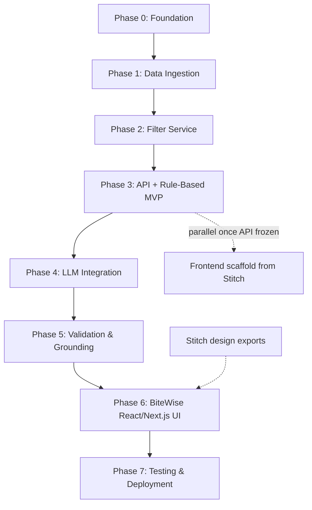

# Implementation Plan: AI-Powered Food Delivery Recommendation System

This document defines a **phasewise implementation plan** for building the Swiggy-inspired restaurant recommendation service. Each phase maps to components in [architecture.md](./architecture.md) and workflow stages in [problemStatement.md](./problemStatement.md).

---

## Table of Contents

1. [Overview](#overview)
2. [Phase Summary](#phase-summary)
3. [Success Criteria Mapping](#success-criteria-mapping)
4. [Phase 0: Project Foundation](#phase-0-project-foundation)
5. [Phase 1: Data Ingestion & Storage](#phase-1-data-ingestion--storage)
6. [Phase 2: Domain Models & Filter Service](#phase-2-domain-models--filter-service)
7. [Phase 3: API Layer & Rule-Based MVP](#phase-3-api-layer--rule-based-mvp)
8. [Phase 4: LLM Integration Layer](#phase-4-llm-integration-layer)
9. [Phase 5: Validation, Fallback & Grounding](#phase-5-validation-fallback--grounding)
10. [Phase 6: Presentation Layer](#phase-6-presentation-layer)
11. [Phase 7: Testing, Observability & Deployment](#phase-7-testing-observability--deployment)
12. [Dependency Graph](#dependency-graph)
13. [Risks & Mitigations](#risks--mitigations)
14. [Suggested Timeline](#suggested-timeline)

---

## Overview

The implementation follows the architecture's **layered pipeline**: build data and filtering first, expose via API, add LLM reasoning with validation, then wrap in a user-facing UI. Early phases deliver working slices without the LLM so filtering and API contracts can be validated independently.

**Implementation strategy:**

1. **Bottom-up** — Data → services → API → LLM → UI
2. **Incremental demo** — Each phase produces a testable artifact
3. **Grounding first** — Deterministic filters and dataset-backed fields before LLM explanations
4. **Fail-safe by default** — Rule-based ranking exists before LLM is wired in
5. **Design-led UI** — Google Stitch exports (`stitch_bitewise_ai_recommendation_interface/`) are the source of truth for BiteWise branding; implement in React/Next.js with Tailwind tokens from `DESIGN.md`

---

## Phase Summary

| Phase | Name | Primary Output | Est. Duration |
|-------|------|----------------|---------------|
| 0 | Project Foundation | Repo structure, dependencies, config | 0.5–1 day |
| 1 | Data Ingestion & Storage | Cleaned dataset, restaurant store | 1–2 days |
| 2 | Domain Models & Filter Service | Filtered candidates from preferences | 1–2 days |
| 3 | API Layer & Rule-Based MVP | REST API with rule-based recommendations | 1–2 days |
| 4 | LLM Integration Layer | Prompt builder, LLM client, parser | 2–3 days |
| 5 | Validation, Fallback & Grounding | Hallucination-safe end-to-end pipeline | 1–2 days |
| 6 | Presentation Layer | BiteWise React/Next.js UI (from Stitch designs) | 2–3 days |
| 7 | Testing, Observability & Deployment | Tests, logging, Docker, docs | 2–3 days |

**Total estimated effort:** 10–16 days (single developer, MVP scope)

---

## Success Criteria Mapping

| Success Criterion (from problem statement) | Addressed In |
|----------------------------------------------|--------------|
| Recommendations grounded in dataset (no hallucinated restaurants) | Phase 5 (validator, enrichment from dataset) |
| Explanations clear and specific to user preferences | Phase 4 (prompt design), Phase 5 (validation) |
| End-to-end flow: input → filter → LLM → display | Phase 3–6 (API + BiteWise Stitch UI) |

---

## Phase 0: Project Foundation

**Goal:** Establish project structure, tooling, and configuration so subsequent phases have a consistent foundation.

**Maps to:** Architecture — Technology Stack, Suggested Project Structure

### Tasks

- [ ] Create repository folder structure per architecture doc
- [ ] Add `requirements.txt` (FastAPI, pandas, pydantic, pydantic-settings, openai or anthropic SDK, pytest, httpx)
- [ ] Create `.env.example` with `LLM_API_KEY`, `LLM_MODEL`, `DATA_PATH`
- [ ] Add `data/config/budget_tiers.json` (low / medium / high cost ranges)
- [ ] Create `src/main.py` with minimal FastAPI app and health endpoint
- [ ] Add `README.md` with setup instructions (dataset download, env vars, run commands)
- [ ] Configure `.gitignore` (`.env`, `data/raw/`, `__pycache__/`, `.venv/`)

### Deliverables

```
recommendation-engine/
├── Docs/
├── data/config/budget_tiers.json
├── src/main.py
├── requirements.txt
├── .env.example
├── .gitignore
└── README.md
```

### Acceptance Criteria

- `pip install -r requirements.txt` succeeds
- `uvicorn src.main:app --reload` starts and `GET /api/v1/health` returns 200
- Budget tier config loads without errors

### Dependencies

- None (first phase)

---

## Phase 1: Data Ingestion & Storage

**Goal:** Load, clean, and persist the Swiggy Kaggle dataset into a searchable restaurant store.

**Maps to:** Problem Statement — Data Ingestion; Architecture — Data Ingestion Layer, Data Architecture

### Tasks

- [ ] Download [Swiggy Restaurants Dataset](https://www.kaggle.com/datasets/ashishjangra27/swiggy-restaurants-dataset) into `data/raw/`
- [ ] Implement `src/data/loader.py` — read CSV, handle encoding and missing file errors
- [ ] Implement `src/data/preprocessor.py`:
  - [ ] Normalize city names (trim, lowercase, alias map e.g. Bengaluru → Bangalore)
  - [ ] Parse cuisine strings into list or normalized string
  - [ ] Convert `cost_for_two`, `rating`, `rating_count` to numeric types
  - [ ] Drop or flag invalid rows (missing name, city, invalid ratings)
  - [ ] Generate stable `id` per restaurant row
- [ ] Implement `src/models/restaurant.py` — Pydantic or dataclass `Restaurant` model
- [ ] Implement `src/data/store.py` — in-memory Pandas DataFrame or SQLite wrapper
- [ ] Write processed output to `data/processed/restaurants.parquet` (or CSV)
- [ ] Add CLI or script: `python -m src.data.loader` (or `scripts/preprocess_data.py`) to run pipeline offline

### Deliverables

- `src/data/loader.py`, `preprocessor.py`, `store.py`
- `src/models/restaurant.py`
- `data/processed/restaurants.parquet`
- Documented column mapping from raw Kaggle schema to internal model

### Acceptance Criteria

- Processed dataset contains all required fields: name, city, cuisine, cost_for_two, rating, rating_count
- Store loads on startup in &lt; 2 s for full dataset
- Spot-check 10 rows: cities normalized, cuisines parsed, numeric fields valid
- Row count and sample stats logged after ingestion

### Dependencies

- Phase 0 complete

---

## Phase 2: Domain Models & Filter Service

**Goal:** Accept user preferences and return a deterministic, filtered candidate list.

**Maps to:** Problem Statement — User Input, Integration Layer; Architecture — Integration Layer (Filter Service)

### Tasks

- [ ] Implement `src/models/preferences.py` — `UserPreferences` model:
  - `location`, `budget`, `cuisine`, `min_rating`, `additional_preferences`, `limit`
- [ ] Implement `src/services/filter_service.py`:
  - [ ] Filter by city (normalized match)
  - [ ] Filter by `min_rating`
  - [ ] Filter by cuisine (substring or token match)
  - [ ] Filter by budget tier using `budget_tiers.json`
  - [ ] Return empty list with reason when no matches
- [ ] Implement candidate selector — cap at K candidates (e.g. 50), prioritize higher rating / rating_count
- [ ] Add helper to list distinct cities and cuisines from store (for future UI dropdowns)
- [ ] Write unit tests in `tests/test_filter_service.py` with fixture data

### Deliverables

- `src/models/preferences.py`
- `src/services/filter_service.py`
- `tests/test_filter_service.py`

### Acceptance Criteria

- Given preferences `{ location: "Bangalore", budget: "medium", cuisine: "North Indian", min_rating: 4.0 }`, filter returns only matching restaurants
- Budget tiers correctly map to cost ranges
- Candidate list never exceeds configured max (e.g. 50)
- All returned candidates exist in the restaurant store
- Tests cover: happy path, empty results, edge cases (missing cuisine match, strict rating)

### Dependencies

- Phase 1 complete (restaurant store populated)

---

## Phase 3: API Layer & Rule-Based MVP

**Goal:** Expose a REST API that accepts preferences and returns rule-based recommendations (no LLM yet). Validates the full request/response contract.

**Maps to:** Problem Statement — Output Display (partial); Architecture — API Design, Fail-safe defaults

### Tasks

- [ ] Implement `src/api/schemas.py` — request/response Pydantic models
- [ ] Implement `src/services/fallback_ranker.py` — sort by `rating * log(rating_count + 1)`
- [ ] Implement `src/api/routes.py`:
  - [ ] `POST /api/v1/recommendations` — validate input, filter, rank, format response
  - [ ] `GET /api/v1/health`
  - [ ] `GET /api/v1/cities` (optional)
  - [ ] `GET /api/v1/cuisines` (optional)
- [ ] Wire routes in `src/main.py`; load restaurant store on startup
- [ ] Handle empty filter results with `suggestions` (e.g. lower min_rating, broaden cuisine)
- [ ] Response includes all display fields from dataset; `why_recommended` uses template string for now
- [ ] Add integration test: `tests/test_api.py` with TestClient

### Deliverables

- `src/api/schemas.py`, `routes.py`
- `src/services/fallback_ranker.py`
- `tests/test_api.py`
- Working OpenAPI docs at `/docs`

### Acceptance Criteria

- `POST /api/v1/recommendations` returns valid JSON matching architecture schema
- All factual fields (name, cuisine, rating, cost, location) come from dataset
- Invalid input returns 400 with clear error message
- Empty filter returns 200 with suggestions, not error
- `meta.source` = `"rule_based"` until Phase 4
- P95 filter + rank latency &lt; 100 ms (excluding LLM)

### Dependencies

- Phase 2 complete

**Milestone:** **Rule-based MVP** — API demoable without LLM API key

---

## Phase 4: LLM Integration Layer

**Goal:** Integrate LLM to rank candidates and generate explanations and optional summary.

**Maps to:** Problem Statement — Recommendation Engine, Integration Layer; Architecture — LLM Integration Design

### Tasks

- [ ] Create `prompts/system.txt` — role, constraints, JSON output schema
- [ ] Create `prompts/user_template.txt` — placeholders for preferences and candidates
- [ ] Implement `src/services/prompt_builder.py` — assemble system + user messages
- [ ] Implement `src/services/recommendation_engine.py`:
  - [ ] LLM client wrapper (OpenAI / Anthropic with JSON mode)
  - [ ] Config via environment (`LLM_API_KEY`, `LLM_MODEL`, temperature)
  - [ ] Response parser for expected schema (`summary`, `recommendations[]`)
  - [ ] Retry on parse failure (max 2 retries with stricter prompt)
- [ ] Define LLM response schema in `src/api/schemas.py`
- [ ] Update `POST /recommendations` to call LLM when candidates exist
- [ ] Add mock LLM client for tests (`tests/mocks/llm_mock.py`)

### Deliverables

- `prompts/system.txt`, `user_template.txt`
- `src/services/prompt_builder.py`, `recommendation_engine.py`
- `tests/test_prompt_builder.py`, `tests/test_recommendation_engine.py` (with mock)

### Acceptance Criteria

- LLM receives only filtered candidates (never full dataset)
- Prompt explicitly forbids inventing restaurants
- Parsed response includes `summary` and per-restaurant `why_recommended`
- `additional_preferences` reflected in explanations (manual spot-check 5 queries)
- Retry succeeds or gracefully triggers fallback (Phase 5)
- Mock-based tests run without live API key

### Dependencies

- Phase 3 complete
- LLM API key configured

---

## Phase 5: Validation, Fallback & Grounding

**Goal:** Ensure 100% grounded recommendations; merge LLM output with dataset; enforce success criteria.

**Maps to:** Problem Statement — Success Criteria; Architecture — Hallucination Prevention, Output Display Layer

### Tasks

- [ ] Implement `src/services/validator.py`:
  - [ ] Validate JSON schema
  - [ ] Reject `restaurant_id` not in candidate list
  - [ ] Reject duplicate ranks
  - [ ] Enforce `limit` on returned recommendations
- [ ] Implement response enrichment — merge LLM ranks/explanations with dataset records (never trust LLM for factual fields)
- [ ] Wire fallback ranker when: LLM timeout, parse failure after retries, validation failure
- [ ] Set `meta.source` = `"llm"` | `"rule_based"` | `"fallback"`
- [ ] Add logging: candidate count, LLM latency, validation failures
- [ ] Write `tests/test_validator.py` — invalid IDs, duplicates, malformed JSON

### Deliverables

- `src/services/validator.py`
- Updated recommendation orchestration in routes or dedicated `recommendation_service.py`
- `tests/test_validator.py`

### Acceptance Criteria

- **Zero hallucinated restaurants** in 20 manual test queries
- Displayed name, rating, cost, cuisine, location always match dataset for same `id`
- Fallback produces valid response when LLM is disabled or returns garbage
- End-to-end: preferences → filter → LLM → validate → enrich → response works via API
- Success criteria 1 and 3 fully met

### Dependencies

- Phase 4 complete

**Milestone:** **LLM-powered backend complete** — API meets all success criteria

---

## Phase 6: Presentation Layer

**Goal:** Implement the **BiteWise** dark-theme web UI by converting Google Stitch design exports into a production-quality **React** or **Next.js** app wired to the existing FastAPI backend.

**Maps to:** Problem Statement — User Input, Output Display; Architecture — User Input Layer (Presentation)

### Design Source (Google Stitch)

UI designs and design tokens are provided in:

```
stitch_bitewise_ai_recommendation_interface/
└── stitch_bitewise_ai_recommendation_interface/
    ├── bitewise/DESIGN.md          # Design system: colors, typography, spacing, components
    ├── home_desktop/code.html      # Home / preference form (desktop)
    ├── results_desktop/code.html   # Ranked results view (desktop)
    └── loading_state/code.html     # Loading skeleton state
```

**Brand:** BiteWise — *"AI picks the perfect meal for you"*

**Design principles (from `DESIGN.md`):**

- Dark tactile theme: near-black backgrounds, layered surfaces, `#2A2A32` borders
- Primary accent `#FF6B35` (CTAs), secondary gold `#FBBF24` (ratings/rank badges)
- AI signature: purple-to-teal gradient for summaries and `why_recommended` blocks
- Typography: **Plus Jakarta Sans** with tabular figures for ratings/prices
- Glassmorphism on hero/overlay elements; rounded organic shapes on cards

### Recommended Stack

| Layer | Choice | Rationale |
|-------|--------|-----------|
| **Framework (recommended)** | **Next.js 14+** (App Router) | File-based routing, env handling, production build, easy API proxy |
| **Framework (alternative)** | **React 18+** + Vite + React Router | Lighter setup if Next.js is not required |
| **Language** | TypeScript | Type-safe API contracts matching `src/api/schemas.py` |
| **Styling** | Tailwind CSS | Matches Stitch HTML exports; port `tailwind.config` tokens from `DESIGN.md` |
| **Icons** | Material Symbols Outlined (as in Stitch) or Lucide React |
| **HTTP client** | `fetch` or TanStack Query | Cities/cuisines caching + recommendation mutations |
| **Forms** | React Hook Form + Zod | Validates `RecommendationRequest` before submit |

**Decision:** Prefer **Next.js** for the demo/production path; use **React + Vite** only if the team wants a minimal SPA without SSR.

### Project Structure

```
frontend/                              # New app (scaffold from Stitch designs)
├── src/
│   ├── app/                           # Next.js App Router (or pages/ for Vite)
│   │   ├── page.tsx                   # Home / search form
│   │   ├── results/page.tsx           # Results view (or same page with state)
│   │   └── layout.tsx                 # Dark theme, fonts, metadata
│   ├── components/
│   │   ├── layout/                    # Header, footer, stats bar
│   │   ├── forms/                     # PreferenceForm, CityCombobox, BudgetPills
│   │   ├── results/                   # RecommendationCard, AISummary, RankBadge
│   │   └── ui/                        # Button, Chip, Skeleton, EmptyState, ErrorState
│   ├── lib/
│   │   ├── api.ts                     # Typed client for /api/v1/*
│   │   └── types.ts                   # Mirrors RecommendationRequest/Response
│   └── styles/
│       └── tokens.css                 # CSS variables from DESIGN.md
├── tailwind.config.ts                 # Port colors/spacing from Stitch HTML
├── .env.local.example                 # NEXT_PUBLIC_API_URL=http://127.0.0.1:8000
└── package.json
```

Keep Stitch exports as **read-only design reference**; do not serve `code.html` directly in production.

### Tasks

**6.1 — Scaffold & design tokens**

- [ ] Create `frontend/` with Next.js (or React + Vite) + TypeScript + Tailwind
- [ ] Port design tokens from `bitewise/DESIGN.md` into `tailwind.config.ts` and CSS variables
- [ ] Add Plus Jakarta Sans via `next/font` (or `@fontsource`)
- [ ] Configure dark mode (`class="dark"` on `<html>`, default dark)

**6.2 — Convert Stitch screens to React components**

- [ ] **Home screen** — from `home_desktop/code.html`:
  - Hero: app name, tagline, stats bar (restaurant/city counts from `GET /health`)
  - Preference form card: location, budget pills, cuisine, min rating, additional preferences, limit
  - Primary CTA "Get Recommendations", secondary "Reset filters"
- [ ] **Loading state** — from `loading_state/code.html`:
  - Disabled form, skeleton cards, "Finding the best spots for you…" message
- [ ] **Results screen** — from `results_desktop/code.html`:
  - AI summary paragraph, meta badges (`returned`, `total_candidates`, `source`)
  - Ranked restaurant cards: name, cuisine chips, rating, cost for two (₹), location, `why_recommended`
  - Gold/silver/bronze accent for ranks #1–#3; AI gradient box for explanations
  - Sticky preference summary sidebar (desktop); collapsible on mobile
- [ ] **Empty state** — design in Stitch or extend results template:
  - Show `empty_reason` + clickable `suggestions` chips
- [ ] **Error state** — network/API failure with retry button

**6.3 — API integration**

- [ ] `GET /api/v1/cities` → searchable city combobox (531 cities; typeahead required)
- [ ] `GET /api/v1/cuisines` → searchable cuisine dropdown ("Any cuisine" default)
- [ ] `POST /api/v1/recommendations` → submit form; navigate or show results panel
- [ ] `GET /api/v1/health` → footer/modal status (data loaded, LLM configured)
- [ ] Map `meta.source` to badges: `llm` → "AI Powered", `rule_based` → "Smart Ranking", `fallback` → "Backup Ranking"
- [ ] Handle nullable `rating` and `cost_for_two` in UI (never display raw `null`)

**6.4 — Backend & dev experience**

- [ ] Enable CORS in FastAPI for `http://localhost:3000` (Next.js default)
- [ ] Optional: Next.js rewrite in `next.config.js` to proxy `/api/v1/*` → FastAPI (avoids CORS in dev)
- [ ] Document two-terminal dev flow: `uvicorn src.main:app --reload` + `npm run dev`
- [ ] Optional: `docker-compose.yml` runs API + frontend together (Phase 7)

**6.5 — Responsive & polish**

- [ ] Mobile layout: single column, sticky bottom CTA, stacked cards
- [ ] WCAG AA contrast on dark surfaces; visible focus rings on inputs
- [ ] Loading UX during LLM call (1–5 s): skeletons, not spinner-only
- [ ] Micro-interactions: card hover lift, smooth transitions (match Stitch feel)

**Option B — CLI (optional, not primary)**

- [ ] Interactive CLI: `python -m src.cli` for headless testing without UI

### Deliverables

- `frontend/` — Next.js or React app implementing all Stitch screens
- `frontend/.env.local.example` with `NEXT_PUBLIC_API_URL`
- Screenshots in README (home, loading, results, empty, error)
- Demo script: full user flow documented in README

### Acceptance Criteria

- UI matches BiteWise Stitch design system (colors, typography, card layout, dark theme)
- User can enter all preference fields from problem statement
- City and cuisine dropdowns populated from live API
- Results display: Restaurant Name, Cuisine, Rating, Cost for Two, Location, Why Recommended
- AI `summary` shown when LLM provides it
- Loading, empty (`empty_reason` + `suggestions`), and error states are user-friendly
- Responsive on mobile and desktop
- Full demo path documented: backend + frontend start commands

### Dependencies

- Phase 5 complete (stable API)
- Stitch design exports present in `stitch_bitewise_ai_recommendation_interface/`

**Milestone:** **End-to-end product demo** — BiteWise UI + API + LLM pipeline complete

---

## Phase 7: Testing, Observability & Deployment

**Goal:** Harden the system for reliability, maintainability, and optional production deployment.

**Maps to:** Architecture — Non-Functional Requirements, Deployment Architecture

### Tasks

- [ ] Expand test coverage:
  - [ ] Unit: filter, validator, parser, fallback ranker
  - [ ] Integration: full API flow with mock LLM
  - [ ] Optional: Playwright or Cypress smoke test for BiteWise UI → API flow
- [ ] Add structured logging (request id, latency, candidate count, source)
- [ ] Add Dockerfile and optional `docker-compose.yml` (API + `frontend/` build)
- [ ] Document deployment steps (Railway, Fly.io, Vercel for frontend, or local Docker)
- [ ] Performance check: document P95 latency for filter vs full LLM path
- [ ] Security review: API keys only in env, input validation, no secrets in repo
- [ ] Update `Docs/architecture.md` if implementation diverges (optional changelog)

### Deliverables

- `tests/` with meaningful coverage of critical paths
- `frontend/` production build (`npm run build`) verified
- `Dockerfile`, optional `docker-compose.yml` (API + frontend)
- Deployment section in README
- CI config (optional): GitHub Actions running pytest

### Acceptance Criteria

- `pytest` passes locally
- Docker image builds and serves API with processed data
- Health endpoint reports ready only after data loaded
- Logs capture LLM failures without exposing API keys
- README enables new developer to run full stack (API + BiteWise UI) in &lt; 30 minutes

### Dependencies

- Phase 6 complete

**Milestone:** **Production-ready MVP**

---

## Dependency Graph



**Parallelization opportunities:**

- Phase 6 frontend scaffolding can start once Phase 3 API contract is frozen (use mock data until Phase 5)
- Convert Stitch `code.html` screens to React components during Phase 4–5 while backend LLM work continues
- Prompt tuning (Phase 4) can overlap with Phase 2 test data preparation
- Port `DESIGN.md` tokens into Tailwind config early so components match BiteWise brand from day one

---

## Risks & Mitigations

| Risk | Impact | Mitigation |
|------|--------|------------|
| Kaggle dataset schema differs from expected columns | Blocks Phase 1 | Inspect raw CSV first; document column mapping; adapter in loader |
| LLM returns invalid JSON | Broken recommendations | JSON mode, retries, fallback ranker (Phase 5) |
| LLM hallucinates restaurant names | Violates success criteria | ID-based validation; enrich from dataset only |
| High LLM latency / cost | Poor UX | Cap candidates (50); use smaller model; cache later |
| Empty filter results common | Empty UX | Suggestions in API; BiteWise empty state with suggestion chips |
| City/cuisine naming inconsistency | Wrong filters | Robust normalization in preprocessor (Phase 1); searchable combobox in UI |
| Stitch HTML ≠ production components | Design drift | Treat `code.html` as reference; enforce tokens from `DESIGN.md` in Tailwind config |
| CORS / separate dev ports | Frontend blocked | FastAPI CORS + optional Next.js API proxy in dev |

---

## Suggested Timeline

Assuming one developer, part-time to full-time:

| Week | Phases | Outcome |
|------|--------|---------|
| Week 1 | Phase 0 → 2 | Data pipeline + filtering working |
| Week 2 | Phase 3 → 4 | API live; LLM integrated |
| Week 3 | Phase 5 → 6 | Grounded recommendations; BiteWise UI wired to API |
| Week 4 | Phase 7 | Tests, Docker, polish |

### Per-Phase Checklist (Quick Reference)

| Phase | Done When |
|-------|-----------|
| 0 | Health endpoint works; config loads |
| 1 | Processed dataset in store; fields validated |
| 2 | Filter returns correct candidates; tests pass |
| 3 | API returns rule-based recommendations |
| 4 | LLM ranks and explains within candidates |
| 5 | No hallucinations; fallback works |
| 6 | BiteWise UI runs full flow against live API (Stitch design fidelity) |
| 7 | Tests green; Docker runs; README complete |

---

## Appendix: File Checklist by Phase

| File | Phase |
|------|-------|
| `requirements.txt`, `.env.example`, `README.md` | 0 |
| `data/config/budget_tiers.json` | 0 |
| `src/data/loader.py`, `preprocessor.py`, `store.py` | 1 |
| `src/models/restaurant.py` | 1 |
| `src/models/preferences.py` | 2 |
| `src/services/filter_service.py` | 2 |
| `tests/test_filter_service.py` | 2 |
| `src/api/schemas.py`, `routes.py` | 3 |
| `src/services/fallback_ranker.py` | 3 |
| `tests/test_api.py` | 3 |
| `prompts/system.txt`, `user_template.txt` | 4 |
| `src/services/prompt_builder.py`, `recommendation_engine.py` | 4 |
| `src/services/validator.py` | 5 |
| `tests/test_validator.py` | 5 |
| `stitch_bitewise_ai_recommendation_interface/` (Stitch exports, design reference) | 6 (input) |
| `frontend/` (Next.js or React + TypeScript + Tailwind) | 6 |
| `frontend/src/lib/api.ts`, `frontend/src/lib/types.ts` | 6 |
| `src/cli.py` (optional) | 6 |
| FastAPI CORS config in `src/main.py` | 6 |
| `Dockerfile`, `docker-compose.yml` (API + frontend) | 7 |

---

## Summary

Build **data and filters first**, then a **rule-based API**, then **LLM reasoning with strict validation**, and finally the **BiteWise UI** (React/Next.js from Google Stitch designs). Phase 3 delivers a demoable backend without LLM costs; Phase 5 is the critical gate for grounded recommendations. Phase 6 completes the problem statement's end-to-end flow by wiring the Stitch-designed frontend to the API. Phase 7 makes the full stack maintainable and deployable.

For component details, schemas, and diagrams, refer to [architecture.md](./architecture.md). For scope and success criteria, refer to [problemStatement.md](./problemStatement.md).
